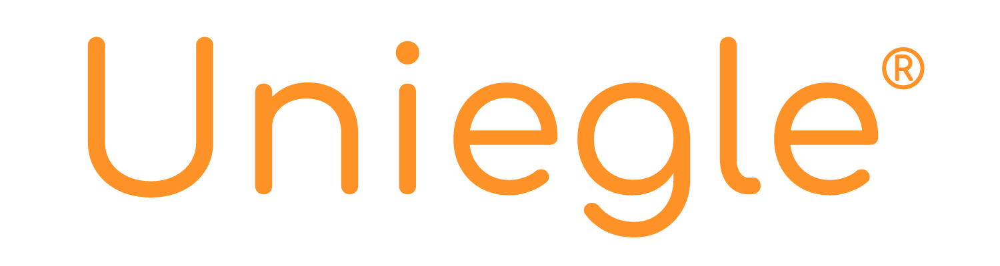
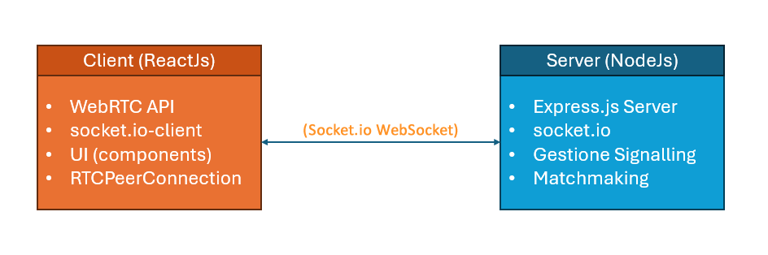

# README - Uniegle

Uniegle è un’applicazione progettata per offrire un’esperienza di connessione immediata tra sconosciuti, ispirata a piattaforme come Omegle e Chatroulette, con un focus su stabilità, qualità di trasmissione e un’interfaccia moderna e intuitiva. Gli utenti possono avviare una comunicazione video e testuale solo dopo aver accettato reciprocamente una richiesta di connessione, garantendo un maggiore controllo e una maggiore sicurezza nelle interazioni.

## La Documentazione

E’ possibile consultare la completa documentazione nella repository:
Uniegle_WebRTC_Documentation.pdf

- Introduzione
- WebRTC
- Architettura e flussi
- Implementazione
- Guida all’utilizzo

## Tools utilizzati

| **FRONT END** | **TOOLS** |
| --- | --- |
| *FRAMEWORK* | ReactJs |
| *LANGUAGE* | HTML, CSS, JSX |
| **BACK END** |  |
| ENVIRONMENT | Node.js |
| *LANGUAGE* | JS |
| **TOOLS** |  |
| *CODE* | VISUAL STUDIO CODE |
| DOCUMENTATION | OVERLEAF |
| *SCRUM SUPPORT* | GitLab |
| *WEB HOSTING FOR TEST* | Render.com |

## Architettura

Il sistema è suddiviso in due principali componenti: **Client (ReactJs)** e **Server (NodeJs)**, che interagiscono tra loro attraverso **Socket.io WebSocket**. Il **client**, sviluppato con **ReactJs**, utilizza la **WebRTC API** per la gestione della comunicazione in tempo reale. L'integrazione di **socket.io-client** consente di stabilire una connessione WebSocket con il server per lo scambio di segnali necessari alla negoziazione della connessione peer-to-peer. L'interfaccia utente (UI) è composta da vari componenti che gestiscono l'esperienza dell'utente, mentre **RTCPeerConnection** si occupa della comunicazione diretta tra i dispositivi. Il **server**, sviluppato con **NodeJs**, include un **Express.js Server** per la gestione delle richieste HTTP e utilizza **socket.io** per la comunicazione WebSocket con il client. È responsabile della **gestione del signalling**, facilitando lo scambio di informazioni tra i peer per l'inizializzazione della connessione WebRTC.

# Guida all’avvio

### Esecuzione del frontend

1. Accedere alla cartella /client: **cd client**
2. Installazione delle dipendenze: **npm install**
3. Avvio del frontend in modalità sviluppatore: **npm run dev**

**(Opzionale) Avvio dell’applicazione in modalità di produzione:**

1. Eseguire il comando di build: **npm run build**
2. Eseguire il comando per l’avvio del frontend: **npm run preview**

### Esecuzione del backend

1. Accedere alla cartella /server: **cd server**
2. Installazione delle dipendenze: **npm install**
3. Avvio del backend: **npm run server**  

### Debug
- Assicurarsi di aver installato le dipendenze con **npm install** prima dell'esecuzione sia del frontend che del backend, come specificato prima.
- Assicurarsi che la porta **4000** sia libera per il server, se no bisogna modificarla nel file **server.js (riga 17)** nella cartella **server**. Inoltre, bisogna cambiarla anche nell'url nel file **router.jsx (riga 10)** nella cartella **frontend/src**.
- Assicurarsi che la porta assegnata in automatico all'avvio del frontend sia configurata correttamente nell'url in **server.js (riga 11)** nella cartella **server**.

# Test dell’app distribuita su Render

Abbiamo pubblicato l’applicazione, comprensiva di frontend e backend, utilizzando il servizio Render.com, che consente di distribuire applicazioni frontend e servizi backend in modo semplice ed efficiente. Dopo aver aperto il link indicato, verrà visualizzata una schermata di caricamento con il messaggio **"Connessione al server..."**. Il processo di connessione potrebbe richiedere dai **30 ai 45 secondi**, poiché al primo tentativo il servizio si avvia automaticamente. Se l’applicazione rimane inutilizzata per un certo periodo di tempo, il server entrerà in standby fino alla successiva riattivazione.

- APP URL: https://uniegle-client.onrender.com/

# Gli Autori

- Felice Micillo
- Francesco Scognamiglio
